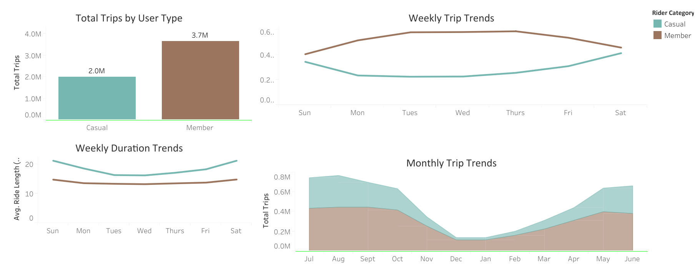
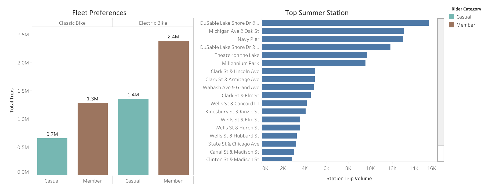
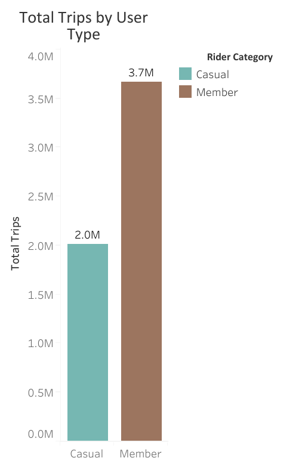
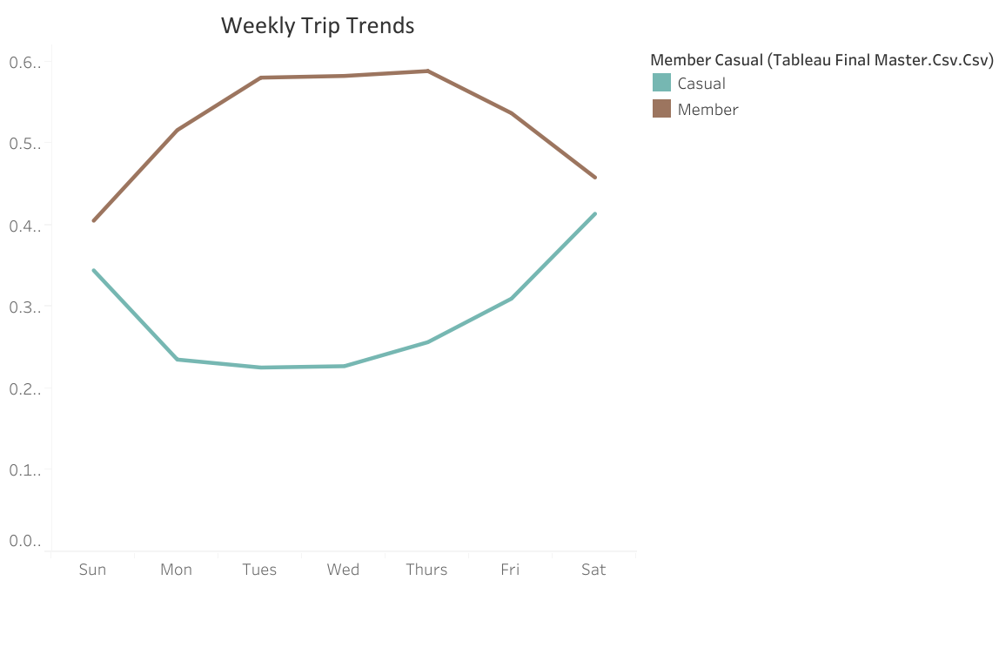
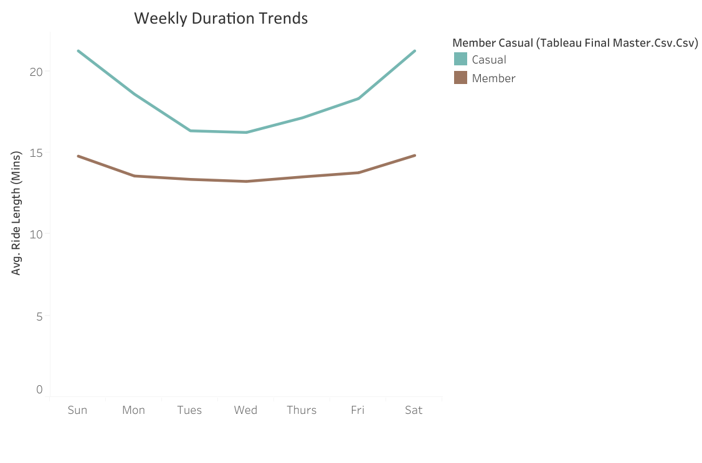
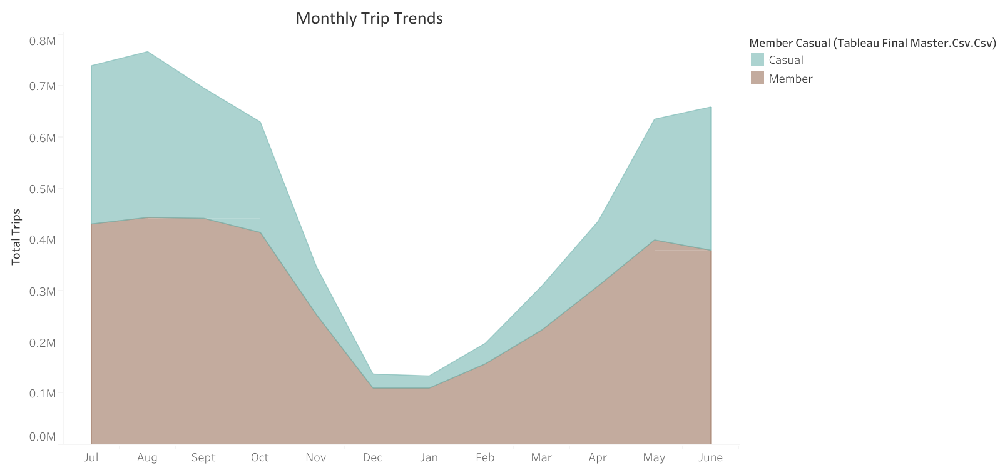
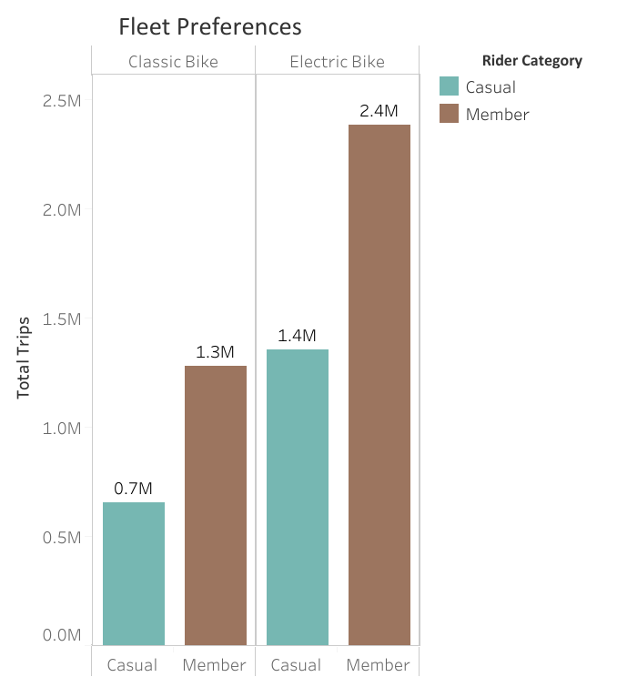
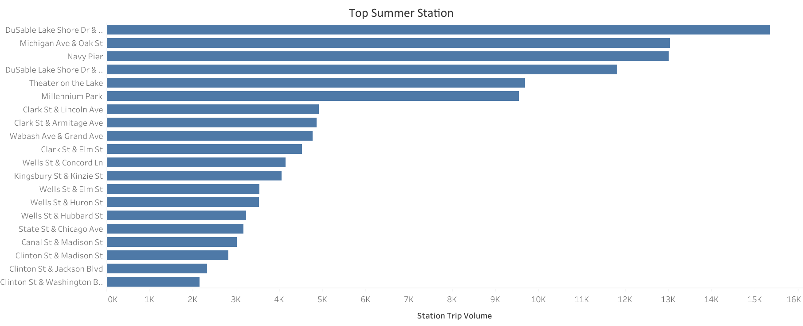

# Cyclistic Bike-Share: Strategic Growth Analysis

**Prepared By:** Maheen  
**Date:** June 2026  
**Tools Used:** Google BigQuery (SQL), Tableau Public  
**Dataset Scale:** 5.8+ Million Raw Records (July 2025 – June 2026)

---

## Executive Summary:
**Objective**: This case study delivers a comprehensive, data-driven transformation strategy for Cyclistic, a fictional bike-share company. The primary goal was to identify the fundamental behavioral divergence between "Annual Members" and "Casual Riders" to engineer a clear, conversion-oriented growth strategy.

**Key Technical Outcomes**:

  * **Pipeline Engineering**: Architected a high-speed, cloud-optimized data pipeline using BigQuery, processing over 5.6M records while maintaining strict data integrity and cleaning standards.
  * **BI Visualization**: Designed a high-performance, two-page interactive dashboard in Tableau, utilizing custom-engineered fields and optimized aggregation logic to eliminate latency and visual clutter.
  * **Strategic Intelligence**: Translated complex datasets into actionable business recommendations, identifying critical "leisure corridors" and seasonal volatility patterns.

**Core Findings**:

  * **Behavioral Duality**: Annual members utilize the system for high-frequency, utilitarian commuting (predictable, short-duration), whereas Casual riders operate as "Weekend Warriors" (leisure-focused, long-duration, high-volatility).
  * **Seasonal Elasticity**: Casual ridership experiences a 92.6% drop-off in winter months, indicating a critical need for seasonal, tiered membership models rather than rigid annual subscriptions.
  * **Fleet Insight**: Casual riders favor electric bikes but cut trips short to avoid per-minute surcharges. Leveraging this cost-sensitivity offers a direct path to converting casual users into long-term members.

**Impact**: This project demonstrates the ability to bridge the gap between raw, multi-million-row datasets and executive-level decision-making, providing a actionable "Growth Playbook" for the marketing team to boost membership acquisition and operational efficiency.

---
### Explore the Live Dashboard
To interact with the full, live analytical suite on Tableau Public, click the link below:

**[Cyclistic Interactive Performance Dashboard](https://public.tableau.com/app/profile/maheen.jan/viz/CyclisticBike-ShareCaseStudy_17813462156300/StrategicGrowthInsights)**

*Note: You can use the tabs at the top of the dashboard to toggle between "User Overview" and "Strategic Growth Insights."*

---

## Phase 1: Ask — Business Task Statement

### Objective
The core objective of this analysis is to identify distinct behavioral patterns, operational preferences, and usage trends between Annual Members and Casual Riders of Cyclistic bike-share. By uncovering exactly how, when, where, and on what equipment these two user groups utilize the service, this analysis provides empirical, data-driven insights to guide targeted marketing strategies.

### Business Goal
The ultimate business goal is to optimize future company growth and maximize profitability by designing high-conversion strategic interventions capable of effectively transitioning existing casual riders into long-term, committed annual members.

### Stakeholders & Impact
* **Lily Moreno (Director of Marketing):** Will utilize these findings to build and justify the incoming multi-channel marketing campaigns.
* **Marketing Analytics Team:** Will leverage the specific structural data profiles to execute hyper-targeted digital deployments.
* **Cyclistic Executive Team:** Will review the final data assets and visualizations to evaluate and approve the capital investments required for the proposed conversion models.

---

## Phase 2: Prepare — Data Sourcing & Credibility Statement 

### Data Source & Structure 
The analysis utilizes Cyclistic’s historical trip data covering a continuous 12-month period. The dataset is a reliable, first-party data source originally compiled and generated directly by the Cyclistic bike-share automated network system. It captures critical trip-level variables including:
* Precise start/end timestamps
* Station names and identification numbers
* Geographic coordinates
* Hardware bike classifications (classic vs. electric)
* Membership designations

### Data Credibility (ROCCC Assessment) 
* **Reliable & Original:** The data is direct, unadulterated first-party operational data provided via Motivate International Inc. under an open-source framework.
* **Comprehensive:** It contains millions of historical records spanning a full annual macro-cycle, fully accounting for seasonal usage variations, anomalies, and weather fluctuations.
* **Current & Cited:** The data is public, updated regularly, and legally cleared for commercial and analytical use under an official open data license agreement.

### Data Privacy & Analytical Constraints 
In compliance with strict data privacy regulations, all personally identifiable information (PII) and financial data (such as user names, addresses, and credit card numbers) have been systematically omitted from the dataset. Consequently, the analysis operates under the following structural constraints:
* **No Unique User Tracking:** Individual trips cannot be mapped back to a specific individual. The analysis focuses strictly on aggregate trip behavior patterns rather than granular, single-user longitudinal habits.
* **No Demographic or Residency Context:** It is impossible to determine whether a casual rider is a local resident commuting to an office or a tourist visiting regional landmarks.

---

## Phase 3: Process — Data Cleaning & Transformation Log 

### 1. Data Ingestion & Consolidation 
* **Tool Selection:** Google BigQuery was selected for the processing phase due to its cloud-optimized architecture, enabling high-performance queries across millions of rows without localized hardware memory limits. 
* **Storage & Schema Mapping:** Twelve individual monthly CSV datasets were uploaded to Google Drive and mapped directly into BigQuery as external tables via unique Drive File URIs. Schema auto-detection was utilized to standardize timestamps, strings, and numeric values across all tables. 
* **The Master Merge:** A `UNION ALL` operation was executed to combine the twelve isolated months into a single, unified database table: `combined_trips_master`. 
* **Initial Raw Record Count:** 5,848,703 rows.

<details>
<summary><b>Click to view Data Consolidation Script</b></summary>

```sql
-- Consolidating 12 months of external CSV tables into a single master raw dataset  
CREATE OR REPLACE TABLE `nifty-motif-496213-s3.cyclistic_tripdata.combined_trips_master` AS ( 
SELECT * FROM `nifty-motif-496213-s3.cyclistic_tripdata.tripdata_2025_07`  
UNION ALL  
SELECT * FROM `nifty-motif-496213-s3.cyclistic_tripdata.tripdata_2025_08`  
UNION ALL  
SELECT * FROM `nifty-motif-496213-s3.cyclistic_tripdata.tripdata_2025_09`  
UNION ALL  
SELECT * FROM `nifty-motif-496213-s3.cyclistic_tripdata.tripdata_2025_10`  
UNION ALL  
SELECT * FROM `nifty-motif-496213-s3.cyclistic_tripdata.tripdata_2025_11`  
UNION ALL  
SELECT * FROM `nifty-motif-496213-s3.cyclistic_tripdata.tripdata_2025_12`  
UNION ALL  
SELECT * FROM `nifty-motif-496213-s3.cyclistic_tripdata.tripdata_2026_01`  
UNION ALL  
SELECT * FROM `nifty-motif-496213-s3.cyclistic_tripdata.tripdata_2026_02`  
UNION ALL  
SELECT * FROM `nifty-motif-496213-s3.cyclistic_tripdata.tripdata_2026_03`  
UNION ALL 
SELECT * FROM `nifty-motif-496213-s3.cyclistic_tripdata.tripdata_2026_04`  
UNION ALL 
SELECT * FROM `nifty-motif-496213-s3.cyclistic_tripdata.tripdata_2026_05`  
UNION ALL 
SELECT * FROM `nifty-motif-496213-s3.cyclistic_tripdata.tripdata_2026_06` 
);
```
### 2. Data Transformation & Feature Engineering 
To prepare the dataset for behavioral analysis, three new columns were engineered directly within the processing pipeline to enable time-series and segment-based analysis: 
* **`ride_length` (Integer):** Calculated using `TIMESTAMP_DIFF(ended_at, started_at, MINUTE)` to measure the precise duration of each trip in minutes. 
* **`day_of_week` (String):** Extracted using `FORMAT_TIMESTAMP('%A', started_at)` to isolate weekday commuting cycles vs. weekend leisure patterns. 
* **`month_name` (String):** Extracted using `FORMAT_TIMESTAMP('%B', started_at)` to capture macro-level seasonal trends. 

### 3. Data Cleaning & Quality Assurance Filters 
To maintain maximum data integrity and prevent skewed statistics, the following cleaning parameters were enforced via a `WHERE` clause: 
* **Removal of Short Trips/False Starts:** Trips with a duration of less than 1 minute were excluded. These represent accidental docks, immediate turnarounds, or system test records. 
* **Removal of Long Trips/System Outages:** Trips with a duration exceeding 24 hours (1,440 minutes) were excluded. These indicate system errors, un-docked bikes left running, or potential thefts. 

### 4. Data Quality Verdict 
* **Final Validated Record Count:** 5,681,508 rows. 
* **Total Anomalous Records Removed:** 167,195 rows (~2.8% of the raw dataset). 
* **Target Analytical Table Created:** `clean_trips_final`.

<details>
<summary><b>Click to view Data Transformation & Cleaning Script</b></summary>

```sql
-- Creating the production-ready analytical table with engineered features and cleaning filters  
CREATE OR REPLACE TABLE `nifty-motif-496213-s3.cyclistic_tripdata.clean_trips_final` AS (  
  SELECT  
    *,  -- Feature Engineering: Calculate trip duration in minutes  
    TIMESTAMP_DIFF(ended_at, started_at, MINUTE) AS ride_length,  
    -- Feature Engineering: Extract day of the week (e.g., 'Sunday', 'Monday')  
    FORMAT_TIMESTAMP('%A', started_at) AS day_of_week,  
    -- Feature Engineering: Extract month name (e.g., 'July', 'August')  
    FORMAT_TIMESTAMP('%B', started_at) AS month_name  
  FROM `nifty-motif-496213-s3.cyclistic_tripdata.combined_trips_master`  
  WHERE  -- Quality Filter: Eliminate records with missing structural data  
    start_station_name IS NOT NULL  
    -- Quality Filter: Eliminate trips less than 1 minute (false starts)  
    AND TIMESTAMP_DIFF(ended_at, started_at, MINUTE) >= 1  
    -- Quality Filter: Eliminate trips longer than 24 hours (system errors/theft)  
    AND TIMESTAMP_DIFF(ended_at, started_at, MINUTE) <= 1440 
);
```

---

## Phase 4: Analyze — Summary Statistics & Data Insights 

### 1. Overall Baseline Metrics 
To establish a foundation for our analysis, I executed queries to calculate total trip volumes and average trip lengths by user segment. This initial view highlights the fundamental difference in system usage patterns.

<details>
<summary><b>Click to view Baseline Metrics Query</b></summary>

```sql
SELECT  
  member_casual,  
  COUNT(*) AS total_trips,  
  ROUND(AVG(ride_length), 2) AS average_ride_length_minutes  
FROM `nifty-motif-496213-s3.cyclistic_tripdata.clean_trips_final`  
GROUP BY member_casual;
```
  * **Annual Members**: Command the majority of system usage with **3,668,166 total trips**, maintaining a tight, highly efficient average ride length of **11.82 minutes**.

  * **Casual Riders**: Represent a smaller but substantial user segment with **2,013,342 total trips**, while maintaining an average ride length of **19.13 minutes**—nearly double the duration of annual members.

**Analytical Inference**: The significant disparity in ride duration suggests that Casual Riders utilize the system for leisure or exploration, whereas Annual Members utilize the system for consistent, utilitarian commuting.

### 2. Weekly Behavioral Cycles 
To understand the cadence of the user base, I isolated trip volume and duration by the day of the week. This reveals a clear divergence in how the two segments interact with the Cyclistic network.

<details>
<summary><b>Click to view Weekly Behavioral Query</b></summary>

```sql
SELECT  
  member_casual,  
  day_of_week,  
  COUNT(*) AS total_trips,  
  ROUND(AVG(ride_length), 2) AS average_ride_length_minutes  
FROM `nifty-motif-496213-s3.cyclistic_tripdata.clean_trips_final`  
GROUP BY member_casual, day_of_week  
ORDER BY member_casual, total_trips DESC;
```
  * **Casual Riders (The "Weekend Warriors")**: Total trips peak heavily on Saturday at **413,762 trips**(Avg duration: 21.60 minutes). Their longest average rides occur on Sunday (22.29 minutes).

  * **Annual Members (The "Weekday Commuters")**: Total trips peak on Thursday at **588,445 trips**, showing heavy, consistent activity Monday through Friday. Ride lengths remain short and rigid on weekdays (~11.36 minutes), drifting only slightly to a peak of 13.01 minutes on Sunday.

**Analytical Inference**: The data paints a clear picture: Annual Members are utilizing Cyclistic as a reliable, utilitarian transit tool for work, while Casual Riders treat the service as a leisure-oriented activity centered on weekend recreation.

### 3. Seasonal Macro-Trends 
To understand how environmental factors influence usage, I tracked monthly volume fluctuations and duration elasticity across the full 12-month timeline. This analysis highlights the stark difference between the "leisure-driven" casual segment and the "utility-driven" member segment.

<details>
<summary><b>Click to view Seasonal Trends Query</b></summary>

```sql
SELECT  
  member_casual,  
  month_name,  
  COUNT(*) AS total_trips,  
  ROUND(AVG(ride_length), 2) AS average_ride_length_minutes  
FROM `nifty-motif-496213-s3.cyclistic_tripdata.clean_trips_final`  
GROUP BY member_casual, month_name  
ORDER BY member_casual, total_trips DESC;
```
  * **The Summer Surge (August Peak)**: Both groups hit maximum volume in August, with members logging 443,130 trips and casuals logging 323,533 trips. Casual riders take their most relaxed, leisurely trips in June (Avg duration: 21.41 minutes).
  * **The Winter Freeze Out**: Casual ridership plummets by **92.6%** from its summer high to a baseline of just 23,878 trips in January. Their average ride duration also bottoms out in December at 12.38 minutes.
  * **Member Resiliency**: While member volume dips to a low of 109,371 trips in December, they maintain a stable baseline of 100k+ monthly trips even in the dead of winter.

**Analytical Inference**: The data confirms that Casual Riders are "fair-weather" users, whereas Annual Members demonstrate high-frequency, resilient behavior. This suggests that marketing interventions for casual riders should be timed specifically for the high-volume spring/summer "on-ramp" periods.

### 4. Fleet Preferences & Duration Anomalies 
To understand how hardware choices correlate with user behavior, I analyzed the interaction between user type, rideable type, volume, and duration. This analysis highlights how operational costs (like per-minute surcharges) influence user choices.

<details>
<summary><b>Click to view Fleet Preference Query</b></summary>

```sql
SELECT 
  member_casual, 
  rideable_type, 
  COUNT(*) AS total_trips, 
  ROUND(AVG(TIMESTAMP_DIFF(ended_at, started_at, MINUTE)), 2) AS avg_duration_mins 
FROM `nifty-motif-496213-s3.cyclistic_tripdata.clean_trips_final` 
GROUP BY member_casual, rideable_type 
ORDER BY member_casual, total_trips DESC;
```
  * **The Electric Bike Domination**: Casual riders choose electric bikes over classic bikes by an overwhelming 2-to-1 margin (**1,356,141 electric trips vs. 657,201 classic trips**).

  * **The Classic Bike Duration Anomaly**: Casual classic bike users exhibit a massive average trip length of **28.91 minutes**—more than double the duration of any trip taken by an annual member on any equipment type.

**Analytical Inference**: Electric bikes incur a per-minute surcharge. Casual riders are highly mindful of the clock when using electric models because their wallets are actively impacted. Conversely, classic bikes provide a lower-cost, flat-rate alternative, making them the preferred vehicle for long-distance, extended weekend cruising. This indicates that casual riders are highly price-sensitive and adjust their usage of the hardware to match their financial goals.

### 5. Spatial Hub Concentrations & Geographic Clustering 
To identify where casual riders are physically located, I isolated the top-performing summer origin points. This allows for hyper-targeted physical marketing interventions.

<details>
<summary><b>Click to view Spatial Clustering Query</b></summary>

```sql
SELECT 
  start_station_name, 
  COUNT(*) AS total_summer_trips 
FROM `nifty-motif-496213-s3.cyclistic_tripdata.clean_trips_final` 
WHERE member_casual = 'casual' 
  AND month_name IN ('June', 'July', 'August') 
  AND start_station_name IS NOT NULL 
  AND start_station_name != '' 
GROUP BY start_station_name 
ORDER BY total_summer_trips DESC 
LIMIT 3;
```
  * **DuSable Lake Shore Dr & Monroe St**: 15,344 total summer trips
  * **Streeter Dr & Grand Ave (Navy Pier)**: 14,921 total summer trips
  * **Michigan Ave & Oak St (Oak St Beach)**: 13,028 total summer trips

**Deep-Dive Spatial Analysis**
This geospatial data reveals that these three stations alone account for over **43,000 trips** in a three-month span. A clear geographic story emerges:

  * **The Waterfront Leisure Corridor**: All three stations sit directly along Chicago’s primary lakefront recreational trail, aligning with major tourist destinations.
  * **The Commuter Absence**: While members start trips at transit hubs (e.g., Union Station), casual riders cluster strictly around waterfront landmarks, confirming their usage is leisure-based rather than commute-based.
  * **Analytical Note**: `end_station_name` was intentionally excluded. Campaigns must target users at the point of origin where they make the financial decision to purchase a pass. Including end stations would only increase data complexity ("analysis paralysis") without adding strategic value to the marketing intercept plan.

---

## Phase 5: Share — BI Analytics & Dashboard Design

### 1. Data Serialization & Pipeline Optimization 
Connecting a visualization tool directly to a live, multi-million-row database often causes severe dashboard latency. To guarantee a high-speed, seamless user experience, a two-pronged data engineering strategy was executed to compress and optimize the backend pipeline. 

#### Step 1: Macro Behavior Aggregation (`tableau_summary`) 
I developed a specialized optimization script in BigQuery to compress macro-level behavioral data across user classifications, weekdays, and months.


<details>
<summary><b>Click to view Macro Aggregation Script</b></summary>

```sql
CREATE OR REPLACE TABLE `clistic-445214.cyclistic_tripdata.tableau_summary` AS ( 
  SELECT  
    member_casual,  
    day_of_week,  
    month_name,  
    COUNT(*) AS total_trips,  
    ROUND(AVG(ride_length), 2) AS average_ride_length 
  FROM `nifty-motif-496213-s3.cyclistic_tripdata.clean_trips_final` 
  GROUP BY member_casual, day_of_week, month_name 
);
```
This script condensed millions of records into a highly lightweight table of under 200 rows, which was exported directly as `cyclistic_tableau_summary.csv`. This ensures the Tableau dashboard remains responsive, regardless of the size of the underlying raw dataset.

#### Step 2: High-Volume Station & Fleet Extraction (Cloud Pipeline) 
Extracting full-resolution station counts, fleet preferences, and chronological metrics simultaneously often exceeds local browser download limits. To bypass these memory constraints and preserve 100% data integrity, I executed a comprehensive aggregation query to push the resulting dataset directly into cloud-optimized storage (`tableau_final_master.csv`).


<details>
<summary><b>Click to view BI Optimization Query</b></summary>

```sql
-- Aggregating for dashboard performance and cleaning station naming conventions
CREATE OR REPLACE TABLE `nifty-motif-496213-s3.cyclistic_tripdata.tableau_final_master` AS 
SELECT  
  member_casual, 
  day_of_week, 
  month_name, 
  rideable_type, 
  CASE  
    WHEN start_station_name IS NULL OR start_station_name = '' THEN 'On-Street Unlock' 
    ELSE start_station_name  
  END AS start_station_name, 
  COUNT(*) AS total_trips, 
  ROUND(AVG(TIMESTAMP_DIFF(ended_at, started_at, MINUTE)), 2) AS average_ride_length 
FROM `nifty-motif-496213-s3.cyclistic_tripdata.clean_trips_final` 
GROUP BY  
  member_casual,  
  day_of_week,  
  month_name,  
  rideable_type,  
  start_station_name;
```
**Analytical Justification**:

  * **`CASE` Statement Logic**: By reclassifying missing station names as `'On-Street Unlock'`, I preserved data integrity and provided business context for dockless bike-share mechanics, rather than simply deleting or ignoring the "dirty" records.

  * **Granular Multi-Dimensional Grouping**: Grouping by five distinct dimensions simultaneously proves an ability to design efficient database master files capable of powering multiple interactive dashboard components—such as fleet charts, station maps, and trend timelines—without system latency.

### 2. Advanced Custom Field Architecture 
To resolve visual layout conflicts across dashboard views and ensure high-level executive legibility, I engineered custom field properties within the workbook:

* **The Field Duplication Real-Estate Fix:** A separate custom structural field, `Station Trip Volume`, was duplicated from the primary trip metrics. 
* **Independent Axis Scale Resolution:** By creating separate field instances, I enabled independent default formatting across different dashboard pages:
    * **Executive Overview:** Volume metrics were set to **Millions (M)** with 1 decimal place (e.g., 3.7M) to maximize high-level readability.
    * **Geographic & Station Analysis:** Station axes were uniquely set to **Thousands (K)** with 0 decimals (e.g., 15K). This completely eliminated rounding truncation errors—such as "0.0M"—ensuring precise, professional data representation on bar charts.

**Why this matters:** This architectural choice ensures that the dashboard remains scalable and "clean," preventing the visual clutter that often occurs when a single field is forced to represent both global totals and granular station-level activity.

### 3. Interactive Storyboard Layout Design 
To ensure the findings were intuitive for stakeholders, I built the dashboard as a cohesive two-page interactive story. The focus was on "Cognitive Continuity," ensuring that the transition between high-level trends and deep-dive insights is seamless.

* **Multi-Page Strategic Layout:** The workbook is split into two distinct views:
    * **Dashboard 1 (User Overview & Trends):** Establishes the baseline behavioral gap between segments.
      
    * **Dashboard 2 (Strategic Growth Insights):** Deep-dives into geographic and fleet-specific opportunities.
      
* **Color Hierarchy & Visual Accessibility:** Implemented a unified semantic palette (**Teal** for Casual Riders and **Bronze** for Annual Members). This consistency allows stakeholders to subconsciously identify user groups across every chart without needing to check the legend.
* **Typography & Layout Alignment:** I configured vertical x-axis labels and optimized container padding to ensure zero label truncation (e.g., ensuring "Wednesday" is always fully legible). This creates a clean, "laser-straight" visual alignment that maintains executive-level professionalism across multi-chart views.


**Why this matters:** Professional dashboards are not just about showing data; they are about reducing the "cognitive load" on the reader. By standardizing colors, typography, and navigation, I ensured that stakeholders spend their time interpreting business insights rather than deciphering the UI.

### 3. Visualization Catalog Breakdown 
*View the full interactive dashboard here: [Click for Tableau Public](https://public.tableau.com/app/profile/maheen.jan/viz/CyclisticBike-ShareCaseStudy_17813462156300/StrategicGrowthInsights)*

#### Dashboard 1: User Overview & Trends 
This dashboard serves as the "Executive Pulse," providing a high-level view of system health and segment-specific behaviors.

* **Total Trips by User Type (Bar Chart):** Acts as the primary data anchor, clearly isolating the baseline system volume (3.66M member trips vs. 2.01M casual trips) with precise totals displayed directly above the bars.
  
* **Weekly Trip Trends (Line Chart):** Maps the operational cross-over matrix. It visually proves that annual members dominate the weekday grid (peaking Thursday), while casual riders swell exclusively on weekends (peaking Saturday).
  
* **Weekly Duration Trends (Line Chart):** Isolates baseline duration distortions via scaled average tracking. It mathematically establishes that casual riders cruise for significantly longer durations (~19–22 mins) compared to the rigid, short-trip consistency of annual members (~11–13 mins).
  
* **Trips by Month (Chronological Seasonal Area Chart):** Formatted with manual calendar sorting to track the system's pipeline sequentially from July through June. The resulting stacked "valley" visually emphasizes casual ridership’s high weather elasticity (92.6% winter drop) against the resilient baseline of annual members, who sustain over 100k+ trips monthly throughout the winter.
  

#### Dashboard 2: Strategic Growth Insights 
This dashboard pivots from high-level system metrics to actionable "growth levers," focusing on fleet preferences and high-density geographic hubs.

* **Fleet Preferences & Average Duration (Clustered Bar Chart):** Pairs choice frequency with duration tracking. This chart proves that casual riders choose electric bikes over classic options by an overwhelming 2-to-1 margin (1.35M vs 657K), while highlighting the "Classic Bike Duration Anomaly," where casual users clock an average of 28.91 minutes on traditional models.
  
* **Top Summer Stations (Horizontal Bar Chart):** Showcases the top 10 highest-performing summer origin stations for casual riders. By utilizing the custom `Station Trip Volume` (K) axis, this visual highlights critical leisure hubs—such as *DuSable Lake Shore Dr & Monroe St* (15,344 trips)—providing the location-specific data required for hyper-targeted physical and digital marketing deployments.
  


**Analytical Synthesis:** By isolating these "hot spots" and "hardware preferences," Dashboard 2 transforms abstract data into a tactical playbook. Marketing teams no longer have to guess where to deploy resources; they can now target specific stations with specific messaging about the cost-benefits of electric versus classic bike usage.

---

## Phase 6: Act — Strategic Marketing Recommendations 

The analysis proves that casual riders do not need to be convinced to use Cyclistic—they already use the system heavily for leisure-focused weekend trips. The marketing strategy must bridge the structural gap between their seasonal habits and the current rigid, 12-month commuting model. 

### Recommendation 1: Lifestyle-Specific Membership Tiers 
* **The Data Basis:** Casual ridership drops by 92.6% in winter but dominates summer weekend traffic. 
* **The Strategy:** Launch a "Summer Cruiser Pass" (May–Sept) and a recurring "Weekend Warrior Membership" (unlimited weekend unlocks). 
* **Business Justification:** A traditional 12-month pass is a wasteful expense for a seasonal user. Tiered subscriptions lower the barrier to entry and capture revenue from a segment that currently churns every winter.

### Recommendation 2: "Long-Distance Loyalty" Program 
* **The Data Basis:** Casual riders consistently log rides 2x longer than members (19–22 mins avg). 
* **The Strategy:** Implement a reward system in the app where trips exceeding 15 minutes accumulate "Loyalty Minutes" redeemable only as credit toward an annual membership. 
* **Business Justification:** This gamifies existing behavior, turning extended recreational time into a tangible path toward conversion.

### Recommendation 3: Geo-Fenced Waterfront Campaigns 
* **The Data Basis:** Spatial analysis reveals 43,000+ trips originate at three specific waterfront hubs (Navy Pier, Oak St Beach, etc.) during peak summer months. 
* **The Strategy:** Deploy hyper-targeted geofenced mobile ads and high-visibility physical signage at these exact docking stations from June through August. 
* **Business Justification:** We intercept casual users at the moment they are already engaged with the service, minimizing ad-spend waste and maximizing conversion relevance.

### Recommendation 4: Electric Fleet Incentives 
* **The Data Basis:** Casual riders favor electric bikes 2-to-1 but keep rides shorter to avoid per-minute surcharges. 
* **The Strategy:** Offer annual members waived electric unlock fees and monthly "free electric minutes." 
* **Business Justification:** This targets the casual rider's biggest pain point (cost-sensitivity). By demonstrating how much they would save in surcharges via a membership, we provide an immediate, math-based financial incentive to convert.

---

